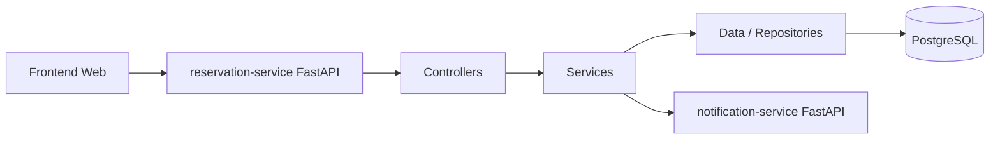
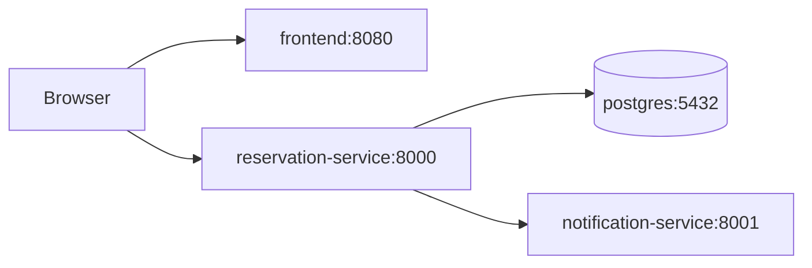

# Rapport Projet DevOps

## Sujet

L'application permet de reserver des ressources, par exemple des salles. Elle expose une API de reservation, un service de notification separe, une base PostgreSQL et une interface web simple.

## Architecture logicielle



## Architecture Docker



## Tests et couverture

Commande :

```powershell
pytest --cov=backend --cov-report=term-missing --cov-report=html
```

Sous OneDrive, utiliser `%TEMP%` pour le fichier coverage si Windows bloque la suppression des fichiers temporaires.

Captures a ajouter avant la remise :

- resultat des tests unitaires.
- rapport de couverture.
- pipeline GitHub Actions reussi.

## Qualite logicielle

Commande :

```powershell
ruff check .
```

Si SonarCloud est configure, ajouter une capture du tableau de bord qualite.

## Google Labs

Ajouter ici les captures d'ecran des Google Labs faits, comme demande dans le sujet.
