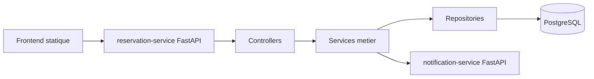
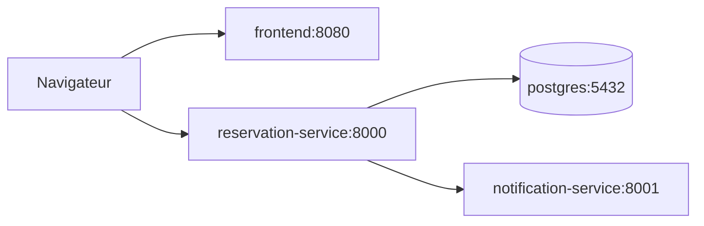

# Rapport Projet DevOps

## Sujet

L'application permet de gerer des ressources reservables, par exemple des salles. Elle expose une API de reservation, un service de notification separe, une base PostgreSQL et une interface web statique.

## Architecture logicielle

Le `reservation-service` suit une architecture en couches :

- `controllers`: routes FastAPI et validation des entrees via Pydantic.
- `services`: regles metier, orchestration des repositories et appel au service de notification.
- `data`: acces SQLAlchemy aux entites `User`, `Resource` et `Reservation`.
- `models` et `schemas`: modele relationnel SQLAlchemy et contrats API Pydantic.



## Architecture Docker



Services Docker :

- `postgres`: base de donnees relationnelle.
- `reservation-service`: API principale FastAPI.
- `notification-service`: API dediee aux notifications.
- `frontend`: Nginx servant `frontend/index.html`.

## Fonctionnalites metier

Ressources :

- champs `capacity`, `resource_type`, `description`, `equipment`, `is_active`.
- creation, listing, lecture, modification et desactivation logique.

Reservations :

- champs `title`, `purpose`, `attendees_count`, `created_at`, `updated_at`.
- creation, listing, lecture, modification et annulation.

Dashboard :

- total des ressources.
- ressources actives et inactives.
- reservations confirmees et annulees.
- reservations a venir.

Notifications :

- `reservation_created`.
- `reservation_updated`.
- `reservation_cancelled`.

## Regles metier

- Une ressource inactive ne peut pas etre reservee.
- Le nombre de participants ne peut pas depasser la capacite de la ressource.
- Un conflit de reservation est detecte a la creation et a la modification.
- La date de fin doit etre strictement posterieure a la date de debut.
- Une reservation deja annulee renvoie une erreur claire lors d'une nouvelle annulation.
- Une reservation annulee ne peut plus etre modifiee.

## Interface web

Le frontend reste statique pour eviter d'ajouter Node.js. Il propose :

- statistiques globales via `/dashboard`.
- creation et activation d'un utilisateur.
- creation, edition, filtrage et desactivation d'une ressource.
- creation, edition, filtrage et annulation d'une reservation.
- affichage des erreurs metier renvoyees par l'API.

## Tests et couverture

Commandes :

```powershell
ruff check .
pytest --cov=backend --cov-report=term-missing --cov-report=xml
```

Sous OneDrive, utiliser `%TEMP%` pour le fichier coverage si Windows bloque la suppression des fichiers temporaires :

```powershell
$env:COVERAGE_FILE="$env:TEMP\devops-reservation.coverage"; pytest --cov=backend --cov-report=term-missing --cov-report=xml
```

Resultat local apres extension :

- `ruff check .`: reussi.
- `pytest -q`: 12 tests reussis.
- couverture backend: 87 %.

Les tests couvrent la couche data, la couche service, les routes FastAPI et le service de notification, notamment :

- creation et listing utilisateurs.
- depassement de capacite.
- ressource inactive.
- conflit sur modification.
- double annulation.
- statistiques dashboard.
- notification avec type d'evenement.

Captures a ajouter avant la remise :

- resultat des tests unitaires.
- rapport de couverture.
- pipeline GitHub Actions reussi.
- dashboard SonarCloud si configure.

## Qualite logicielle

La qualite est controlee par :

- `ruff` pour le lint Python.
- `pytest` pour les tests automatises.
- `pytest-cov` pour le suivi de couverture.
- GitHub Actions pour executer les controles a chaque push ou pull request.
- SonarCloud optionnel via le secret `SONAR_TOKEN`.

## Outils externes requis

- Docker Desktop.
- GitHub.
- GitHub Actions.
- SonarCloud si utilise.
- Google Cloud Skills Boost ou Google Labs selon la consigne Moodle.

## Google Labs

Ajouter ici les captures d'ecran des Google Labs faits, comme demande dans le sujet. Le fichier `google lab.txt` peut servir de trace locale, mais les captures Moodle doivent etre ajoutees au rendu final.
